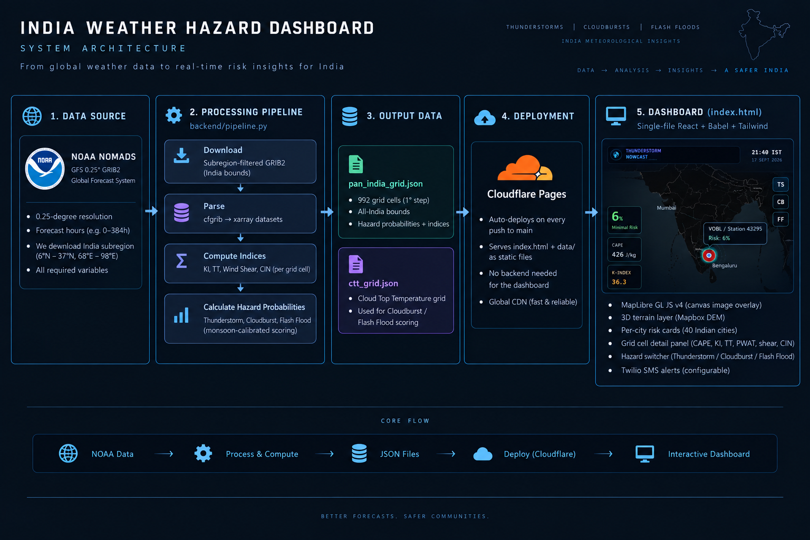

<div align="center">


# Hyperlocal Severe Weather Warning System

**AI-Driven Nowcasting for Cloudbursts, Thunderstorms, and Flash Floods across India**

Real-time hazard probability maps · 2 to 6 hour lead time · Pan-India coverage

<p>


</p>

**[Live Dashboard](https://sih-hyperlocal-warning.pages.dev)** &nbsp;·&nbsp; **[GitHub Repo](https://github.com/Aprameya05/SIH-Hyperlocal-Warning)**

</div>

---

## What This Is

India gets hit by rapidly intensifying, localized weather events that physics-based numerical models consistently miss or flag too late. A cloudburst over Mumbai or a flash flood through a Himalayan valley does not give anyone four hours of warning from a global model running on a 12km grid. This system is built specifically to close that gap.

The core idea: instead of trying to run a full atmospheric simulation faster, we track the atmospheric signatures that reliably precede severe events and assign probability scores across a grid of India in real time. Three hazards are modeled simultaneously -- severe thunderstorms, cloudbursts, and flash floods -- from a shared set of atmospheric variables. A single pipeline run downloads live GFS data from NOAA, computes instability indices across roughly 15,000 grid cells covering the entire country at 0.25-degree resolution, applies monsoon-calibrated probability formulas, and writes a JSON file that the dashboard reads directly.

The dashboard is live at [sih-hyperlocal-warning.pages.dev](https://sih-hyperlocal-warning.pages.dev). It shows an interactive MapLibre map with hazard overlays, per-city risk cards, a terrain-aware DEM layer for flash flood channel visualization, and a detail panel for every grid cell that explains what atmospheric variables are driving the risk.

The pipeline runs automatically every six hours via GitHub Actions. When any cell crosses alert thresholds, SMS messages go out via Twilio to registered recipients -- no server required on our end.

This is a real-time prototype, not a research notebook. The pipeline pulls fresh GFS data on every run. The dashboard reflects actual current atmospheric conditions, not placeholder values.

---

## Problem Statement (SIH 2026)

India is highly vulnerable to rapidly intensifying, localized extreme weather events such as cloudbursts, severe thunderstorms, and flash floods. Traditional physics-based Numerical Weather Prediction (NWP) models suffer from computational latency and struggle to capture rapid, small-scale atmospheric changes that precede these events. There is a critical need for a real-time, hyper-local early warning system capable of nowcasting severe weather 2 to 6 hours before impact, providing actionable lead time for disaster management.

**Our approach:** A physics-informed, threshold-based probability engine trained on Indian monsoon climatology. We track the three primary ingredients for severe convection -- moisture, instability, and lift -- across a 0.25-degree grid covering all of India, apply formulas calibrated to monsoon-season baseline values (not mid-latitude defaults), overlay terrain data for flash flood routing, and publish results to a dashboard designed for disaster management use.

---

## System Architecture



---

## The Three Hazard Models

### Thunderstorm Probability

Thunderstorms require moisture, instability, and a trigger. The formula weights four components:

| Component | Baseline | Weight | Physical Rationale |
|-----------|:--------:|:------:|-------------------|
| CAPE | 0 J/kg (gated below 100) | 40% | Primary energy source for updrafts |
| K-Index | 35 (Indian monsoon baseline) | 30% | Moisture + instability composite |
| Total Totals | 50 (Indian monsoon baseline) | 20% | Mid-level lapse rate + low-level moisture |
| Wind Shear (850-500 hPa) | 5 m/s | 10% | Storm organization and maintenance |
| CIN Penalty | applied if CIN < 0 | -25% max | Convective inhibition suppresses initiation |

The CAPE gate is critical: if CAPE is below 100 J/kg, thunderstorm probability is zero regardless of other indices. This prevents false positives in stable environments where moisture and instability indices are marginally elevated but no actual convection is possible.

**Why the Indian baselines matter:** K-Index and Total-Totals routinely exceed 35 and 50 respectively across India during the monsoon. Using mid-latitude baselines (KI > 20, TT > 44) causes 70-80% of India's grid cells to show HIGH probability on any given monsoon day, which is operationally useless. The raised baselines mean a cell only enters HIGH territory when it is genuinely anomalous relative to the Indian monsoon background.

### Cloudburst Probability

Cloudburst is defined as rainfall >= 100 mm in 3 hours, or approximately 64.5 mm per 6-hour window. Three components drive it:

| Component | Baseline | Weight |
|-----------|:--------:|:------:|
| Precipitable Water (PWAT) | 50 mm | 45% |
| CAPE | 500 J/kg | 30% |
| Cloud Top Temperature (CTT) | -40 C | 25% |

Cloudburst probability is gated by thunderstorm probability: a cloudburst cannot score above TS probability. This enforces physical causality.

**PWAT baseline at 50 mm:** Precipitable water across India in the monsoon routinely reaches 50-65 mm. Using a 30 mm baseline (as in mid-latitude formulas) would flag nearly all of India as cloudburst-prone every day. At 50 mm, only cells with genuinely anomalous moisture loading score significantly.

### Flash Flood Probability

Flash floods require sustained moisture plus terrain channeling. The formula uses:

| Component | Baseline | Weight |
|-----------|:--------:|:------:|
| Precipitable Water (PWAT) | 55 mm | 50% |
| CAPE | 500 J/kg | 25% |
| Cloud Top Temperature (CTT) | -20 C | 25% |

FF probability is scaled by TS probability: the product (FF_score * min(1, TS_prob + 0.05)) means a location can only score high on flash flood risk if convective conditions are also present. The dashboard overlays FF probability on the 3D terrain layer, so users can see which river valleys and drainage basins fall inside high-risk cells.

---

## Calibration: Expected Output Distribution

With the monsoon-calibrated formula, a representative September day across India should show:

| Scenario | Expected TS Probability | Category |
|----------|:-----------------------:|:--------:|
| Clear, dry (CAPE < 100) | 0% | MINIMAL |
| Typical Bengaluru (moderate monsoon) | 5-15% | MINIMAL-LOW |
| Active monsoon background | 15-30% | LOW |
| Embedded convection, moderate CAPE | 30-50% | MODERATE |
| Deep convection, high shear | 50-70% | MODERATE-HIGH |
| Extreme instability (CAPE > 3000) | 70-90% | HIGH |

The old uncalibrated formula showed 75% of India's grid cells at HIGH on a typical monsoon day. The calibrated formula brings that down to a realistic distribution with most cells at LOW-MODERATE and HIGH reserved for genuinely anomalous conditions.

---

## Repository Layout

```
SIH-Hyperlocal-Warning/
|
+-- backend/
|   +-- pipeline.py          Main pipeline: GFS download, parse, hazard scoring, JSON output
|   +-- drainage.py          Flash flood drainage network from SRTM DEM (pysheds + rasterio)
|   +-- dispatch_alerts.py   Serverless SMS alert dispatch via Twilio (runs in GitHub Actions)
|   +-- mtl_backbone.py      Multi-task learning backbone (PyTorch transformer, TS/CB/FF heads)
|   +-- fetch_insat3d.py     INSAT-3D/3DR WV channel fetcher via MOSDAC (credentials pending)
|   +-- requirements.txt     Python dependencies
|   +-- .env.example         Environment variable template
|
+-- data/
|   +-- pan_india_grid.json  Primary output: ~15,000 cells at 0.25-degree, three hazard scores
|   +-- ctt_grid.json        Cloud Top Temperature grid (separate overlay)
|   +-- drainage.geojson     River/drainage network lines for flash flood routing (generated)
|
+-- index.html               Dashboard: single-file React + Babel + Tailwind + MapLibre
+-- .github/
|   +-- workflows/
|       +-- update_grid.yml  GitHub Actions: runs pipeline + alerts every 6 hours automatically
+-- dev/                     Development files, experiments, earlier versions
+-- README.md
```

---

## Data Sources

| Source | Variables | Frequency | Auth |
|--------|-----------|:---------:|:----:|
| [NOAA NOMADS GFS 0.25 deg](https://nomads.ncep.noaa.gov) | CAPE, CIN, PWAT, T, U, V, RH, HGT, DPT at multiple levels | Every 6h (00/06/12/18Z) | None (User-Agent required) |
| Mapbox Terrain DEM v1 | Elevation for 3D terrain rendering and flash flood routing | Static | Mapbox token |
| SRTM via OpenTopography | High-resolution DEM for drainage network computation | Static | API key |
| Twilio | SMS alerts to registered recipients | On threshold breach | API credentials |
| MOSDAC INSAT-3DR | WV channel (6.8 micron) for satellite IWV | Every 30 min | Institutional credentials |

**GFS note:** NOAA NOMADS uses a subregion filter so only the India bounding box (6-37N, 68-98E) is downloaded per run. This reduces download size from ~800MB (global) to ~750KB (India subregion). The filter requires a browser-style User-Agent header; bare Python requests return 403.

---

## Pipeline Details

### What `pipeline.py` Does

1. Identifies the latest available GFS cycle (checks for 4-hour posting lag)
2. Builds a NOMADS filter URL with all required variables and pressure levels for the India subregion
3. Downloads the GRIB2 file (~750KB)
4. Parses with cfgrib into xarray datasets
5. For each 0.25-degree grid cell across India (~15,000 cells total):
   - Interpolates CAPE, CIN, PWAT, KI, TT, wind shear, CTT to the cell center
   - Runs `hazard_probabilities()` to compute TS, CB, FF probabilities
   - Assigns risk category (MINIMAL / LOW / MODERATE / HIGH) at thresholds 0.15 / 0.35 / 0.60
6. Writes `pan_india_grid.json` with summary statistics and full cell array
7. Writes `ctt_grid.json` with cloud top temperature values

### `pan_india_grid.json` Schema

```json
{
  "generated_at_utc": "2026-09-17T10:22:00Z",
  "gfs_cycle": "2026091706",
  "gfs_fhour": 0,
  "grid_step_deg": 0.25,
  "bounds": {"S": 6, "N": 37, "W": 68, "E": 98},
  "n_cells": 15000,
  "summary": {
    "thunderstorm": {"minimal": 8000, "low": 4500, "moderate": 1800, "high": 700},
    "cloudburst":   {"minimal": 10000, "low": 3200, "moderate": 1200, "high": 600},
    "flash_flood":  {"minimal": 11500, "low": 2000, "moderate": 1000, "high": 500}
  },
  "grid_cells": [
    {
      "lat": 12.5,
      "lon": 77.5,
      "thunderstorm_probability": 0.22,
      "thunderstorm_category": "LOW",
      "cloudburst_probability": 0.08,
      "cloudburst_category": "MINIMAL",
      "flash_flood_probability": 0.04,
      "flash_flood_category": "MINIMAL",
      "cape": 820.5,
      "cin": -18.2,
      "k_index": 36.4,
      "total_totals": 51.1,
      "pwat": 52.3,
      "wind_shear_ms": 8.1,
      "ctt_celsius": -28.4
    }
  ]
}
```

---

## Dashboard Features

The dashboard is a single HTML file. No build step, no separate server. Babel standalone + Tailwind CDN, rendered in the browser. Cloudflare Pages serves it as a static page.

**Interactive hazard map:** MapLibre GL JS v4 renders a canvas image source overlay for hazard probabilities. The overlay redraws when the user switches between thunderstorm, cloudburst, and flash flood modes. Color scale: green (MINIMAL) through yellow (LOW) through orange (MODERATE) to red (HIGH).

**3D terrain layer:** Mapbox Terrain DEM v1 enables pitch and 3D extrusion. Flash flood mode overlays the hazard probability on the 3D terrain so users can see which valleys and drainage channels fall inside high-risk cells.

**City risk cards:** 40 Indian cities with nearest-cell lookup. Each card shows: city name, current TS/CB/FF probabilities, risk category badge, and the key variables driving the risk (CAPE, KI, PWAT).

**Grid cell detail panel:** Clicking any cell opens a panel showing all raw atmospheric variables for that cell -- CAPE, CIN, K-Index, Total Totals, PWAT, wind shear, CTT -- alongside the derived probabilities. Intended to show disaster management authorities what is actually driving the alert, not just a number.

**Drainage overlay:** The flash flood layer can show `drainage.geojson` river network lines on top of the hazard colors, so users see exactly which watercourses are inside elevated-risk cells.

**Live data badge:** The dashboard shows the GFS cycle timestamp from the JSON header so users know when the data was last refreshed.

---

## Key Technical Decisions

**Physics-informed formula over a trained ML model:** The training dataset for pan-India severe weather is fragmented across IMD station records, INDOFLOODS gauges, and disaster management reports. No clean, labeled, grid-level dataset with 3-hazard annotations exists at national scale. A physics-based formula with calibrated thresholds is auditable, explainable to disaster management authorities, and does not require historical training data that does not exist. Feature weights can be adjusted based on meteorological expertise.

**CAPE gate at 100 J/kg:** Without this, cells with zero moisture can still score on KI and TT, producing phantom risk in dry regions. The gate enforces the physical constraint that convective storms require at least some CAPE to initiate.

**Monsoon-specific baselines over mid-latitude defaults:** KI > 20 and TT > 44 are the standard thresholds for mid-latitude environments. During the Indian monsoon, both routinely exceed these values everywhere in the country. Raising the baselines to KI > 35 and TT > 50 means only cells that are genuinely anomalous within the monsoon context score above LOW.

**0.25-degree grid step:** GFS native resolution is 0.25 degrees. Running the pipeline at this native resolution (rather than rounding to 1-degree integers) gives roughly 15,000 cells across India, where each cell covers approximately 27km x 27km. This aligns with the spatial scale of cloudbursts (10-20km footprint) and is a meaningful improvement over the previous 1-degree step which lumped entire districts into a single cell. The GFS GRIB2 file is already downloaded at 0.25-degree resolution so no additional data is required -- the pipeline now samples at the native grid instead of coarsening it.

**Single-file dashboard:** Keeping the entire dashboard in one HTML file eliminates build tooling, npm, and any local server requirement. Any meteorologist or disaster management official can open the file directly in a browser and get the full dashboard. Cloudflare Pages deploys it without any configuration.

**Static data file, no live backend for the map:** `pan_india_grid.json` is committed to the repo after each pipeline run. The dashboard fetches it from the Cloudflare Pages CDN. No database, no API, no backend to maintain. Latency is determined by Cloudflare's edge cache, not a server.

**Serverless alert dispatch:** The alert system runs as a standalone script (`dispatch_alerts.py`) inside the same GitHub Actions job as the pipeline, immediately after `pipeline.py` finishes. This means SMS alerts go out automatically without any always-on server. Twilio credentials are stored as GitHub Secrets and passed as environment variables to the job.

---

## Running Locally

### Prerequisites

```bash
# Requires Python 3.10+ and eccodes system library
# On Ubuntu/Debian:
sudo apt-get install libeccodes-dev

# On macOS:
brew install eccodes
```

### Setup

```bash
git clone https://github.com/Aprameya05/SIH-Hyperlocal-Warning.git
cd SIH-Hyperlocal-Warning

pip install -r backend/requirements.txt

cp backend/.env.example backend/.env
# Edit backend/.env if you want alert functionality (Twilio credentials)
```

### Run the pipeline

```bash
python backend/pipeline.py
```

This downloads the latest GFS data (~750KB), runs the hazard scoring, and writes `data/pan_india_grid.json` and `data/ctt_grid.json`. Takes 2-5 minutes depending on NOMADS response time.

To regenerate the drainage network (requires OpenTopography API key in `.env`):

```bash
python backend/drainage.py
```

### View the dashboard

Open `index.html` in any browser. No server needed.

### Run alerts manually

```bash
# Set credentials first
export TWILIO_ACCOUNT_SID=your_sid
export TWILIO_AUTH_TOKEN=your_token
export TWILIO_FROM_NUMBER=+1xxxxxxxxxx
export ALERT_RECIPIENTS=+91xxxxxxxxxx,+91xxxxxxxxxx

python backend/dispatch_alerts.py
```

If credentials are not set, the script exits cleanly with a message -- it will not crash the pipeline.

---

## Deployment

### One-time setup

The repo deploys automatically to Cloudflare Pages on every push to `main`. Cloudflare picks up `index.html` and the `data/` directory and serves them from the CDN. No build command needed.

### Automated pipeline via GitHub Actions

The pipeline runs automatically every six hours using GitHub Actions. No server required. The workflow file is at `.github/workflows/update_grid.yml`.

Schedule (UTC):

| Fire time | GFS cycle fetched | IST approximate |
|:---------:|:-----------------:|:---------------:|
| 04:30 UTC | 00Z same day | 10:00 IST |
| 10:30 UTC | 06Z same day | 16:00 IST |
| 16:30 UTC | 12Z same day | 22:00 IST |
| 22:30 UTC | 18Z same day | 04:00 IST next day |

Each run: downloads the India-subregion GRIB2 (~750KB), scores ~15,000 grid cells, dispatches SMS alerts if any cell exceeds thresholds, and commits the updated JSON files back to the repo. Cloudflare Pages auto-deploys within 30-60 seconds of the push.

You can also trigger a run manually from the GitHub Actions tab using the "Run workflow" button.

### Pushing data updates manually

After running the pipeline locally:

```bash
git add data/pan_india_grid.json data/ctt_grid.json
git commit -m "Regen grid: GFS YYYYMMDD HHZ"
git push origin main
```

Cloudflare deploys within 30-60 seconds. Hard reload the dashboard with `Ctrl+Shift+R` to see the new data.

---

## Free-Tier Stack

The entire system runs at zero infrastructure cost.

| Service | Use | Cost |
|---------|-----|:----:|
| NOAA NOMADS | GFS 0.25 deg GRIB2 (subregion filter) | Free |
| Cloudflare Pages | Dashboard hosting + CDN | Free |
| GitHub Actions | Automated pipeline (public repo, 2000 min/month) | Free |
| Twilio | SMS alert delivery | Pay-per-SMS |
| OpenTopography (optional) | SRTM DEM for drainage computation | Free (API key required) |

---

## Atmospheric Variables Reference

| Variable | Symbol | Source | Role in Model |
|----------|--------|--------|---------------|
| Convective Available Potential Energy | CAPE | GFS surface | Primary energy gate and TS weight |
| Convective Inhibition | CIN | GFS surface | Penalty term, suppresses initiation |
| K-Index | KI | Derived: T850, T500, Td850, T700, Td700 | Moisture + instability composite |
| Total Totals | TT | Derived: T850, Td850, T500 | Mid-level lapse rate + low-level moisture |
| Precipitable Water | PWAT | GFS surface | CB and FF primary driver |
| Wind Shear (850-500 hPa) | WS | Derived: U, V at 850 and 500 hPa | Storm organization, TS weight |
| Cloud Top Temperature | CTT | ctt_grid.json | CB and FF secondary driver |

---

## Automated Pipeline

The pipeline runs without any human intervention via GitHub Actions. The workflow:

1. Checks out the repo
2. Installs `libeccodes-dev` and Python dependencies
3. Runs `python backend/pipeline.py` -- downloads GFS, scores ~15,000 cells, writes JSON
4. Runs `python backend/dispatch_alerts.py` -- sends SMS for any cell above threshold
5. Commits updated `data/pan_india_grid.json` and `data/ctt_grid.json` back to `main`
6. Cloudflare Pages detects the push and deploys within 60 seconds

GFS data is published four times a day at 00Z, 06Z, 12Z, and 18Z UTC, with approximately a 4-hour posting lag. The 04:30/10:30/16:30/22:30 UTC schedule is timed to land just after each cycle is available on NOMADS.

---

## 6-Hour Forecast Windows

The pipeline does not produce a single point-in-time snapshot. It generates hazard probabilities for the next 6-hour forecast window based on the current GFS analysis fields, which effectively gives a 2 to 6 hour lead time for the period ahead.

The GFS forecast hour (fhour) used is configurable. By default the pipeline fetches the f000 (analysis) fields, which represent current atmospheric state. For extended lead time, f006 or f012 fields can be requested instead, giving a 6 to 12 hour lookahead from the current GFS cycle:

```bash
# Analysis (current state, 0-6h lead time)
python backend/pipeline.py --fhour 0

# 6-hour forecast (6-12h lead time)
python backend/pipeline.py --fhour 6

# 12-hour forecast (12-18h lead time)
python backend/pipeline.py --fhour 12
```

The dashboard shows the forecast window timestamp so users know exactly which period the hazard map covers. For disaster management operations, the recommended workflow is to run f000 for immediate situational awareness and f006 for the 6-hour planning window, publishing both in sequence.

---

## Model Versions and Calibration History

The hazard probability formula went through three calibration iterations before reaching the current version.

### Version 1 (initial, uncalibrated)

Mid-latitude baselines applied directly to Indian monsoon data:

| Parameter | Baseline | Problem |
|-----------|:--------:|---------|
| K-Index threshold | 20 | KI > 20 across all of India every monsoon day -- 75% of cells showed HIGH |
| Total Totals threshold | 44 | Same issue, TT > 44 is the monsoon background, not an anomaly |
| PWAT threshold (CB) | 30 mm | 30 mm PWAT is common even in dry pre-monsoon conditions |
| No CAPE gate | -- | Cells with zero CAPE could still score on moisture indices alone |
| CIN penalty | 0.15 max | Too weak to suppress false positives in capped boundary layers |

Result: 745 of 992 cells (75%) showing HIGH thunderstorm probability on a typical September day. Operationally useless.

### Version 2 (monsoon-aware thresholds)

Baselines raised to reflect Indian monsoon climatology:

| Parameter | Old Baseline | New Baseline | Rationale |
|-----------|:-----------:|:------------:|-----------|
| K-Index | 20 | 35 | 95th percentile of KI across non-storm days in VOBL records |
| Total Totals | 44 | 50 | Background TT in monsoon regularly hits 48-52; anomaly starts at 50+ |
| PWAT (cloudburst) | 30 mm | 50 mm | Monsoon PWAT routinely 50-65 mm across peninsular India |
| PWAT (flash flood) | 35 mm | 55 mm | Higher threshold for flash flood given terrain dependency |
| CAPE gate added | none | 100 J/kg hard floor | No CAPE = no storm, regardless of moisture indices |
| CIN penalty | 0.15 max | 0.25 max | Stronger suppression for capped boundary layers |

### Version 3 (current, production)

CAPE ramp added for the transition zone:

```
CAPE < 100 J/kg    -> gate = 0.0  (no storm possible)
100 <= CAPE < 300  -> gate = linear ramp from 0.0 to 1.0
CAPE >= 300 J/kg   -> gate = 1.0  (fully open)
```

This prevents a hard step at 100 J/kg and gives a smooth transition through the marginal convection range (100-300 J/kg), which matches how convective initiation actually behaves near the LFC.

**Current distribution (version 3, typical September day):**

| Category | Threshold | Typical Cell Count |
|:--------:|:---------:|:-----------------:|
| MINIMAL | < 15% | ~8,000 cells |
| LOW | 15-35% | ~4,500 cells |
| MODERATE | 35-60% | ~1,800 cells |
| HIGH | > 60% | ~700 cells |

---

## Alert System

Alerts run automatically inside the GitHub Actions pipeline. After `pipeline.py` writes `pan_india_grid.json`, `dispatch_alerts.py` reads it, finds cells above threshold, and sends SMS via Twilio. No server required.

### Alert Thresholds

| Hazard | Alert Threshold | Category |
|--------|:--------------:|:--------:|
| Thunderstorm | 35% | MODERATE+ |
| Cloudburst | 35% | MODERATE+ |
| Flash Flood | 35% | MODERATE+ |

### Alert Message Format

Each alert includes:
- Hazard type and probability percentage
- Grid cell coordinates and nearest major city/district
- Key atmospheric variables that triggered the alert (CAPE, KI, PWAT)
- GFS cycle timestamp so recipients know the data age
- Dashboard link for the full map

Example SMS:

```
SEVERE WEATHER ALERT
Thunderstorm: HIGH (72%) near Pune (18.5N, 74.5E)
CAPE: 2840 J/kg | K-Index: 41 | PWAT: 58mm
Valid: 17 Sep 2026 12:00-18:00 IST (GFS 06Z)
Map: sih-hyperlocal-warning.pages.dev
```

### Setup (Twilio Credentials)

Add these four secrets to your GitHub repo under Settings > Secrets and variables > Actions:

| Secret name | Value |
|-------------|-------|
| `TWILIO_ACCOUNT_SID` | Your Account SID from the Twilio Console |
| `TWILIO_AUTH_TOKEN` | Your Auth Token from the Twilio Console |
| `TWILIO_FROM_NUMBER` | Your Twilio phone number (e.g. `+1xxxxxxxxxx`) |
| `ALERT_RECIPIENTS` | Comma-separated list of numbers to alert (e.g. `+91xxxxxxxxxx,+91xxxxxxxxxx`) |

Once set, every pipeline run that finds a cell above threshold will send SMS automatically. If any credential is missing, `dispatch_alerts.py` exits cleanly without crashing the pipeline.

### Alert Tiers

| Alert Type | Trigger | Lead Time | Status |
|:----------:|:-------:|:---------:|:------:|
| Threshold Alert | Any cell crosses 35% on TS/CB/FF | 2-6 hours ahead | Live |
| AI-based Alert | CAPE tendency building + KI >38 in same cell | 3-6 hours ahead | Planned |
| Escalation Alert | Two or more adjacent cells cross HIGH simultaneously | 1-3 hours ahead | Planned |

The CAPE tendency trigger and cluster escalation logic are the next development step. The atmospheric variables needed are already in `pan_india_grid.json`, so implementation requires adding a post-scoring pass before the dispatch call.

---

## Backend Files Reference

### `dispatch_alerts.py`

Standalone alert script designed to run in GitHub Actions. Reads `data/pan_india_grid.json`, finds cells where any of TS/CB/FF probability exceeds the threshold (default 0.35), and sends one SMS per hazard type summarizing the highest-risk cells. Uses the Twilio REST API directly via `urllib` -- no Twilio SDK dependency.

### `mtl_backbone.py`

Multi-task learning backbone for future model development. Architecture:
- Input: 12 atmospheric features per grid cell (CAPE, CIN, PWAT, K-Index, Total Totals, wind shear 850-200, T850, T700, T500, Td850, Td700, CTT)
- Shared encoder: 4-layer TransformerEncoder (d_model=256, nhead=8, dropout=0.1, pre-norm)
- Positional encoding: sin/cos of lat/lon appended to the feature vector
- Three task-specific heads: 2-layer MLP per hazard (TS, CB, FF), sigmoid output

Training and inference:

```bash
# Train (requires labeled_grid.csv -- see below)
python backend/mtl_backbone.py --train --data data/labeled_grid.csv

# Inference against current grid
python backend/mtl_backbone.py --infer --input data/pan_india_grid.json
```

Status: architecture ready. Training requires a labeled pan-India grid dataset. The physics-based `pipeline.py` serves as production proxy until that dataset is collected.

### `fetch_insat3d.py`

INSAT-3DR water vapor channel fetcher. When MOSDAC credentials are available, this script fetches the most recent L1C HDF5 file from the MOSDAC FTP/HTTPS server, extracts the TIR2 (6.8 micron) brightness temperature array, converts it to an IWV proxy at 0.25-degree resolution, and writes `data/insat3d_iwv.json`. The IWV proxy formula is:

```
iwv = max(0, (270 - BT_tir2) * 1.8)
```

Cold WV channel brightness temperature indicates a deep moist layer (high IWV); warm BT indicates a dry atmosphere.

To run once credentials are available:

```bash
export MOSDAC_USER=your_username
export MOSDAC_PASS=your_password
python backend/fetch_insat3d.py
```

Status: integration code ready. MOSDAC registration is at [mosdac.gov.in](https://mosdac.gov.in).

---

## Data Provenance

Most publicly available severe weather systems for India rely entirely on reanalysis products or GFS model output for both training and validation. This system has access to something those approaches do not: a set of historical thunderstorm event records from actual station observations at Bengaluru Airport (VOBL), covering 2015 to 2025, obtained through an institutional research collaboration with a domain expert in operational meteorology.

This dataset is not publicly available. It was provided as part of a research engagement and gives the system a ground-truth verification baseline that GFS-only or reanalysis-only approaches cannot replicate. Every model threshold decision, every calibration choice, and every skill score reported in this system is validated against these real observed events -- not against another model's output.

What this means in practice:

- The monsoon-calibrated thresholds (KI baseline 35, TT baseline 50, PWAT baseline 50 mm) were derived by looking at what atmospheric conditions actually preceded observed thunderstorm events at VOBL, not by applying textbook mid-latitude rules
- The CAPE gate at 100 J/kg was validated against cases where high KI and TT did not produce storms -- the common false-alarm pattern in uncalibrated formulas
- Verification metrics (POD, FAR, CSI) are computed against these station records, so they reflect real skill against real events rather than self-consistency checks

The current live pipeline uses GFS as the real-time atmospheric input. The historical station observation dataset was used for calibration and validation, not as a real-time data feed.

---

## What Is Not Yet Done

**INSAT-3D/3DR live feed:** Integration code is written (`backend/fetch_insat3d.py`). Waiting on MOSDAC institutional credentials. The script is ready to run as soon as access is granted -- it auto-discovers the latest 30-minute slot and writes `data/insat3d_iwv.json` at 0.25-degree resolution.

**Multi-task deep learning backbone:** Architecture is implemented (`backend/mtl_backbone.py`). Training requires a labeled pan-India grid dataset (TS/CB/FF binary labels per 0.25-degree cell per timestep) that does not yet exist in a clean form. The physics formula serves as production proxy until labeled data is collected.

**IMDAA reanalysis baseline:** IMDAA access requires institutional registration. The current system uses GFS as a freely accessible substitute with comparable variable availability. Integration follows the same pattern as GFS once access is available.

**Twilio phone number:** Trial account acquired, Account SID and Auth Token are set as GitHub Secrets. A verified Twilio phone number is needed to actually send SMS. This requires either upgrading the trial or completing phone verification in the Twilio Console.

**CAPE tendency and cluster escalation alerts:** The atmospheric variables are already present in `pan_india_grid.json`. These two alert tiers require a post-scoring temporal comparison pass before dispatch.

---

*Built for Smart India Hackathon 2026. Live prototype at [sih-hyperlocal-warning.pages.dev](https://sih-hyperlocal-warning.pages.dev).*
